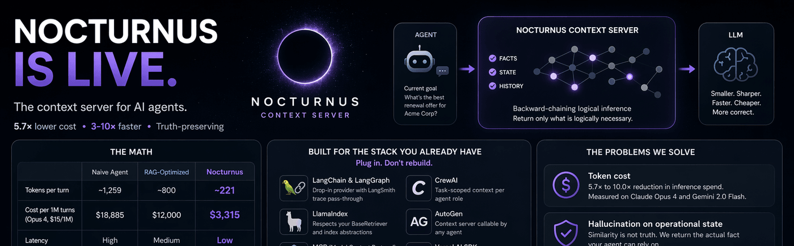

# NocturnusAI

[](https://github.com/Auctalis/nocturnusai/actions/workflows/ci.yml)
[](https://pypi.org/project/nocturnusai/)
[](https://www.npmjs.com/package/nocturnusai-sdk)
[](https://github.com/Auctalis/nocturnusai/pkgs/container/nocturnusai)
[](LICENSE)
[](https://nocturnus.ai/docs/mcp)

> **The context engineering engine for AI agents: send only what changed.**



---

## Before / After

```python
# ❌ Without NocturnusAI — replay everything, every turn
messages = system_prompt + full_history + tool_outputs   # ~1,259 tokens/turn
response = llm(messages)                                 # $13,600/mo at scale

# ✅ With NocturnusAI — send only what changed
ctx = nocturnus.process_turns(raw_turns)                 # extract → infer → delta
messages = system_prompt + ctx.briefing_delta             # ~221 tokens/turn
response = llm(messages)                                 # $2,400/mo. Same accuracy.
```

---

## The Numbers

Measured on live APIs. 15-turn product support conversation. Real `usage.input_tokens` counts. [Run it yourself.](https://nocturnus.ai/benchmark)

| | Naive replay | RAG-optimized | **NocturnusAI** |
|---|---|---|---|
| Tokens per turn | ~1,259 | ~800 | **~221** |
| Cost per month (1K req/hr, Opus 4, $15/1M) | $13,600 | $12,000 | **$2,400** |
| Latency | high | medium | **low** |
| Truth-preserving | no | no | **yes** |

Claude Opus 4: **5.7×** reduction. Gemini 2.0 Flash: **10.0×**. [Full calculations.](https://nocturnus.ai/calculations)

---

## Install

```bash
pip install nocturnusai          # Python
npm install nocturnusai-sdk      # TypeScript
docker run -p 9300:9300 ghcr.io/auctalis/nocturnusai:latest  # Docker
```

Or use the setup wizard:

```bash
curl -fsSL https://raw.githubusercontent.com/Auctalis/nocturnusai/main/install.sh | bash
```

---

## Why Developers Star This Repo

- **Reproducible token reduction** — benchmark in the repo, methodology published, run it against your own workload
- **Deterministic inference** — same query, same result, every time. No embedding drift, no cosine similarity lottery
- **Truth maintenance** — retract a fact, all derived conclusions auto-retract. No stale context, no hallucination on operational state
- **Plugs into existing stacks** — LangChain, LlamaIndex, CrewAI, AutoGen, MCP, Vercel AI SDK, OpenAI Agents SDK, Mastra
- **Benchmarkable against naive replay** — numbers derived, not invented. Every claim traces to a notebook cell

---

## Framework Quickstarts

| Framework | Integration | Link |
|---|---|---|
| **LangChain / LangGraph** | Drop-in `NocturnusContextProvider`, LangSmith trace pass-through | [Docs](https://nocturnus.ai/docs/integrations) |
| **CrewAI** | Task-scoped context per agent role | [Docs](https://nocturnus.ai/docs/integrations) |
| **AutoGen** | Context server callable by any agent | [Docs](https://nocturnus.ai/docs/integrations) |
| **MCP** | Spec-compliant server for Claude Desktop, Cursor, Continue | [Config](https://nocturnus.ai/docs/mcp) |
| **OpenAI Agents SDK** | Context middleware, no tool modifications | [Docs](https://nocturnus.ai/docs/integrations) |
| **Vercel AI SDK** | Edge-compatible adapter for Next.js, Nuxt, SvelteKit | [Docs](https://nocturnus.ai/docs/integrations) |
| **Python SDK** | `pip install nocturnusai` | [Docs](https://nocturnus.ai/docs/sdks) |
| **TypeScript SDK** | `npm install nocturnusai-sdk` | [Docs](https://nocturnus.ai/docs/sdks) |

---

## How It Works

Three steps. Every turn.

1. **Extract** — raw conversation turns → structured facts via LLM extraction
2. **Infer** — backward-chaining logical inference finds only the facts reachable from the agent's current goal
3. **Return the delta** — a `briefingDelta` containing only what changed since the last turn

This is not vector search. It is not summarization. It is deterministic inference on a logic engine — [Hexastore](https://nocturnus.ai/docs/concepts) indexing, [backward chaining](https://nocturnus.ai/how-it-works), and [truth maintenance](https://nocturnus.ai/docs/concepts#truth-maintenance).

---

## The Working Loop

> **LLM required for natural-language turns.** The examples below send raw text turns through an LLM to extract structured facts. If you start the server without an LLM provider, natural-language turns will return zero facts. See [Quick Start](#quick-start) for setup options, or use predicate syntax (e.g., `"customer_tier(acme_corp, enterprise)"`) which works without any LLM.

### 1. First reduction: `POST /context`

```bash
curl -X POST http://localhost:9300/context \
  -H 'Content-Type: application/json' \
  -H 'X-Tenant-ID: default' \
  -d '{
    "turns": [
      "user: Customer says they are enterprise and blocked on SLA credits.",
      "tool: CRM says account is Acme Corp with a 2M ARR contract.",
      "agent: Last week support promised to review SLA eligibility.",
      "tool: Billing note says renewal is due next month."
    ],
    "maxFacts": 12
  }'
```

### 2. Goal-driven pass: `POST /memory/context`

```bash
curl -X POST http://localhost:9300/memory/context \
  -H 'Content-Type: application/json' \
  -H 'X-Tenant-ID: default' \
  -d '{
    "goals": [{"predicate":"eligible_for_sla","args":["acme_corp"]}],
    "maxFacts": 12,
    "sessionId": "ticket-42"
  }'
```

### 3. Later turns: `POST /context/diff`

```bash
curl -X POST http://localhost:9300/context/diff \
  -H 'Content-Type: application/json' \
  -H 'X-Tenant-ID: default' \
  -d '{"sessionId": "ticket-42", "maxFacts": 12}'
```

Returns only `added` and `removed` entries between snapshots.

### 4. End of thread: `POST /context/session/clear`

```bash
curl -X POST http://localhost:9300/context/session/clear \
  -H 'Content-Type: application/json' \
  -H 'X-Tenant-ID: default' \
  -d '{"sessionId":"ticket-42"}'
```

---

## Choose Your Surface

<details>
<summary><b>Python SDK</b></summary>

```python
from nocturnusai import SyncNocturnusAIClient

with SyncNocturnusAIClient("http://localhost:9300") as client:
    ctx = client.process_turns(
        turns=[
            "user: Customer says they are enterprise and blocked on SLA credits.",
            "tool: CRM says account is Acme Corp with a 2M ARR contract.",
        ],
        scope="ticket-42",
        session_id="ticket-42",
    )

    diff = client.diff_context(session_id="ticket-42", max_facts=12)
    client.clear_context_session("ticket-42")

    print(ctx.briefing_delta)
```

</details>

<details>
<summary><b>TypeScript SDK</b></summary>

```ts
import { NocturnusAIClient } from 'nocturnusai-sdk';

const client = new NocturnusAIClient({
  baseUrl: 'http://localhost:9300',
  tenantId: 'default',
});

const ctx = await client.processTurns({
  turns: [
    'user: Customer says they are enterprise and blocked on SLA credits.',
    'tool: CRM says account is Acme Corp with a 2M ARR contract.',
  ],
  scope: 'ticket-42',
  sessionId: 'ticket-42',
});

const diff = await client.diffContext({ sessionId: 'ticket-42', maxFacts: 12 });
await client.clearContextSession('ticket-42');
console.log(ctx.briefingDelta);
```

</details>

<details>
<summary><b>MCP</b></summary>

```json
{
  "mcpServers": {
    "nocturnus": {
      "url": "http://localhost:9300/mcp/sse",
      "transport": "sse"
    }
  }
}
```

Use the `context` tool each turn for a salience-ranked working set. Pair MCP with the HTTP context endpoints when you need goal-driven assembly and diffs.

</details>

---

## What Lives Behind The Workflow

When you do need backend mechanics, NocturnusAI provides them:

- Deterministic fact and rule storage
- Backward-chaining inference with proof chains
- Truth maintenance and contradiction handling
- Temporal facts with `ttl`, `validFrom`, and `validUntil`
- Multi-tenancy via `X-Database` and `X-Tenant-ID`
- MCP, REST, Python SDK, TypeScript SDK, and CLI surfaces over the same engine

---

## Quick Start

### Docker (fastest)

```bash
docker run -d --name nocturnusai -p 9300:9300 \
  --restart unless-stopped \
  -v nocturnusai-data:/data \
  ghcr.io/auctalis/nocturnusai:latest
```

```bash
curl http://localhost:9300/health   # Verify it's running
```

### Docker with Ollama (enables natural-language extraction)

```bash
docker run -d --name nocturnusai -p 9300:9300 \
  --add-host=host.docker.internal:host-gateway \
  -e LLM_PROVIDER=ollama \
  -e LLM_MODEL=granite3.3:8b \
  -e LLM_BASE_URL=http://host.docker.internal:11434/v1 \
  -e EXTRACTION_ENABLED=true \
  ghcr.io/auctalis/nocturnusai:latest
```

### From this repo

```bash
make up-ollama && make smoke
```

---

## CLI

```bash
nocturnusai                                # Interactive REPL
nocturnusai -e "context 10"               # Salience-ranked working set
nocturnusai -e "compress"                 # POST /memory/compress
nocturnusai -e "cleanup 0.05"             # POST /memory/cleanup
```

---

## Documentation

Full docs: **[nocturnus.ai](https://nocturnus.ai)**

| | |
|---|---|
| [Start Here](https://nocturnus.ai/docs) | The turn-reduction workflow |
| [Context Workflow](https://nocturnus.ai/docs/context) | Raw turns → optimize → diff → clear |
| [API Reference](https://nocturnus.ai/docs/api) | REST endpoints and response shapes |
| [SDKs](https://nocturnus.ai/docs/sdks) | Python and TypeScript client methods |
| [Integrations](https://nocturnus.ai/integrations) | LangChain, CrewAI, AutoGen, MCP, and more |
| [Benchmark](https://nocturnus.ai/benchmark) | Measured token reduction on live APIs |
| [Calculations](https://nocturnus.ai/calculations) | Every number, derived |
| [How It Works](https://nocturnus.ai/how-it-works) | The extraction → inference → delta pipeline |

---

## Docker Compose (advanced)

```bash
git clone https://github.com/Auctalis/nocturnusai.git && cd nocturnusai

make up                                        # Server using .env.example defaults
make up-ollama                                 # + Ollama (reuses host or starts bundled)
make up-monitoring                             # + Prometheus + Grafana
make smoke                                     # Verify health + context endpoint
```

## Build from Source

Requires JDK 17+.

```bash
./gradlew :nocturnusai-server:run              # HTTP server on :9300
./gradlew :nocturnusai-cli:run                 # Interactive REPL (JVM)
./gradlew :nocturnusai-cli:nativeCompile       # Build native binary
./gradlew test                                 # Full test suite
```

---

## Contributing

See [CONTRIBUTING.md](CONTRIBUTING.md). Issues labelled `good first issue` are good entry points.

## Security

Report vulnerabilities privately via [GitHub Security Advisories](https://github.com/Auctalis/nocturnusai/security/advisories/new). See [SECURITY.md](SECURITY.md).

## License

[Business Source License 1.1](LICENSE) (SPDX: `BUSL-1.1`). Free for internal use — including internal production — inside your own organization. Offering NocturnusAI or substantial functionality as a product/hosted service to third parties requires a commercial license ([licensing@nocturnus.ai](mailto:licensing@nocturnus.ai)). Converts to Apache 2.0 on 2030-02-19. See [LICENSE](LICENSE) and [DISCLAIMER.md](DISCLAIMER.md).

---

> **LEGAL & SAFETY NOTICE**
>
> NocturnusAI is a deterministic reasoning engine, but **its output is only as reliable as the facts provided to it.**
>
> 1. **No Warranty of Truth.** "Verified" refers to logical consistency of inference, not accuracy of real-world claims.
> 2. **Not for Autonomous High-Stakes Decisions.** Do not use this engine for unsupervised medical, financial, legal, or physical-safety decisions without an independent human verification step.
> 3. **Logic Layer Only.** NocturnusAI provides information and inference; it does not execute actions.
> 4. **No Liability.** See [DISCLAIMER.md](DISCLAIMER.md) and [LICENSE](LICENSE).
